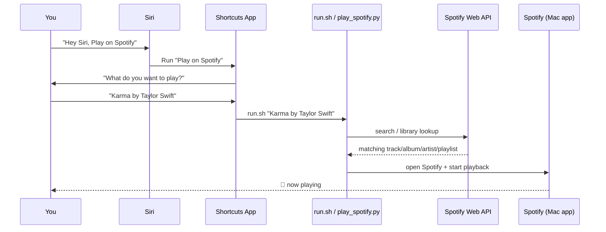
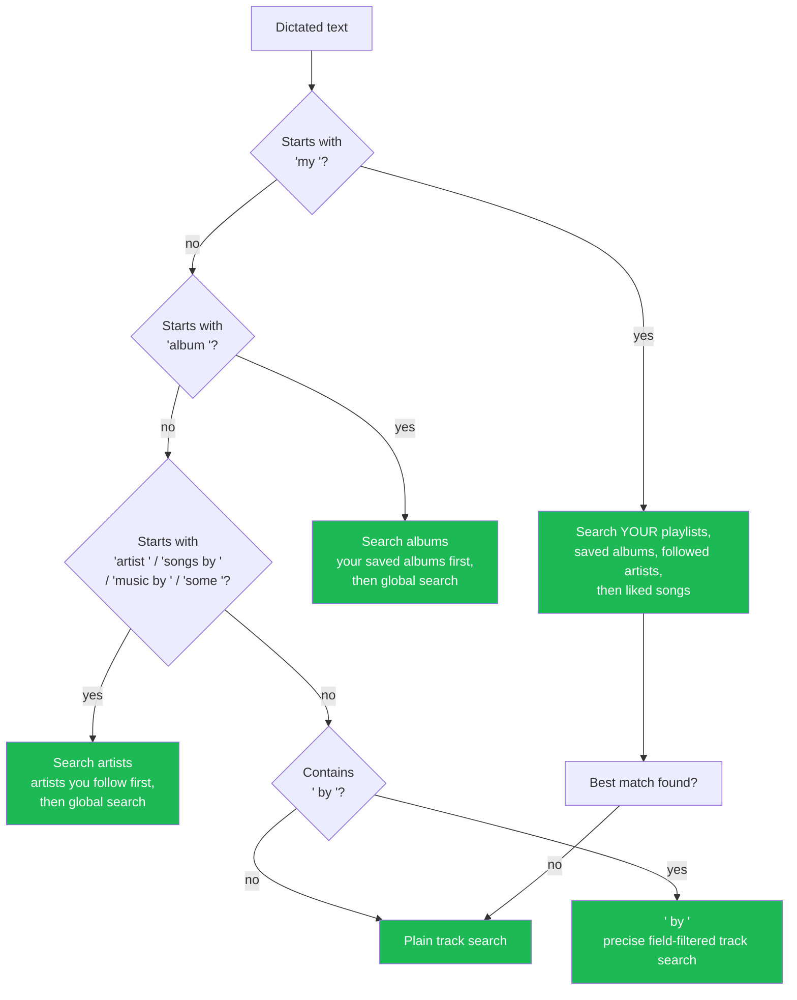
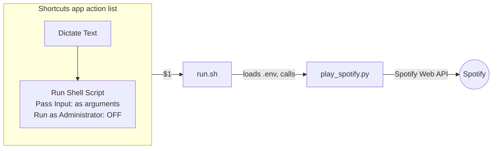

# spotify-siri

Say "Hey Siri, Play on Spotify," tell it a song, album, artist, playlist, or
"my liked songs," and it actually plays on your Mac's Spotify app — no
official Spotify Shortcuts support required.

```
"Hey Siri, Play on Spotify"
        │
        ▼
"What do you want to play?"
        │
        ▼
   "Karma by Taylor Swift"
        │
        ▼
   🎵 Spotify starts playing Karma — Taylor Swift
```

## How it works

Apple Shortcuts can dictate speech and run a shell script, but it has no
built-in way to talk to Spotify. This project bridges that gap: the Shortcut
hands your dictated text to a small Python script, which uses the official
Spotify Web API to find the right thing and start playback on your Mac.



## What you can say

The dictated text is parsed for a few patterns, checked in this order:



| You say | What happens |
|---|---|
| `Karma by Taylor Swift` | Finds that exact track by that exact artist |
| `Blinding Lights` | Plain track search |
| `album Midnights` | Plays the album (your saved copy first, else the top global match) |
| `artist Coldplay` | Plays that artist's radio/top tracks (checks who you follow first) |
| `my liked songs` | Plays your 200 most recent Liked Songs |
| `my Mix Rnbro and Avi` | Plays a playlist from your library matching that name |
| `my The Local Train` | Falls through to "artist you follow" if no playlist matches |

If nothing in your library matches a `my ...` request, it automatically
falls back to a general Spotify search instead of failing outright.

## Requirements

- macOS with the **Spotify desktop app** installed
- **Spotify Premium** — as of March 2026, Spotify requires the developer
  app's owner account to have an active Premium subscription for the Web API
  to work at all in Development Mode. Without it you'll get a
  `403 Active premium subscription required` error.
- Python 3 (tested with the Homebrew build)
- The [Shortcuts](https://support.apple.com/guide/shortcuts/welcome/ios) app

## Setup

### 1. Create a Spotify Developer app

1. Go to the [Spotify Developer Dashboard](https://developer.spotify.com/dashboard)
   and log in with the account that has Premium.
2. Click **Create App**, give it any name/description.
3. Set the Redirect URI to exactly:
   ```
   http://127.0.0.1:8888/callback
   ```
4. Save, then open the app's Settings and copy the **Client ID** and
   **Client Secret**.

### 2. Clone this repo and set up the virtual environment

Homebrew's Python refuses `pip install` outside a virtual environment (PEP
668 "externally-managed-environment"), so this project uses one:

```bash
git clone <this-repo-url> spotify_siri
cd spotify_siri
python3 -m venv venv
./venv/bin/pip install -r requirements.txt
```

### 3. Add your credentials

```bash
cp .env.example .env
```

Edit `.env` and fill in the values from step 1:

```
SPOTIFY_CLIENT_ID=your_client_id_here
SPOTIFY_CLIENT_SECRET=your_client_secret_here
SPOTIFY_REDIRECT_URI=http://127.0.0.1:8888/callback
```

`.env` is gitignored — your secrets never get committed.

### 4. Authorize once

The first run opens a browser so you can log in and grant access. After
that, a refresh token is cached at `~/.cache/spotify_siri_token` and no
further browser popups are needed.

```bash
./run.sh "Blinding Lights"
```

If Spotify starts playing Blinding Lights, you're set.

### 5. Create the Shortcut

In the Shortcuts app:

1. **New Shortcut**, name it something like "Play on Spotify."
2. Add a **Dictate Text** action.
   - Stop Listening: `After Pause`
3. Add a **Run Shell Script** action, configured exactly like this:

| Setting | Value |
|---|---|
| Shell | `zsh` |
| Input | `Dictated Text` |
| Pass Input | **`as arguments`** (not "to stdin" — see Troubleshooting) |
| Run as Administrator | **unchecked** (it'll prompt for your password otherwise, breaking hands-free use) |

Script contents:

```zsh
#!/bin/zsh
/absolute/path/to/spotify_siri/run.sh "$1"
```

Replace the path with wherever you cloned this repo.

4. Done. Say **"Hey Siri, `<your Shortcut's name>`"**, answer with a song,
   album, artist, or "my liked songs," and it should start playing.



## Troubleshooting

| Symptom | Cause | Fix |
|---|---|---|
| `no such file or directory: .../venv/bin/python` | The whole script was pasted into the Shortcut instead of calling `run.sh`, and path auto-detection broke under Shortcuts' temp-file execution | Call `run.sh` by absolute path instead of embedding its contents |
| `q=''` / "No search query" | Pass Input is set to `to stdin` instead of `as arguments`, so `$1` is empty | Change Pass Input to `as arguments` |
| `Couldn't write token to cache at /var/root/...` | "Run as Administrator" is checked, so the script runs as root and can't find your cached token | Uncheck "Run as Administrator" |
| `403 Active premium subscription required for the owner of the app` | Spotify's March 2026 policy requires the app owner to have Premium; can take hours to propagate after upgrading | Confirm the Premium account owns the app; try rotating the Client Secret in the Dashboard, which several developers report clears the propagation delay |
| Wrong song/album/artist plays | Spotify's search ranking can vary with the `limit` parameter | Already handled — the script fetches multiple candidates and picks the best name match itself instead of trusting Spotify's single top hit |

## Project structure

```
spotify_siri/
├── play_spotify.py     # Core logic: parses intent, queries Spotify, starts playback
├── run.sh              # Entry point the Shortcut calls; loads .env, invokes the venv's Python
├── requirements.txt
├── .env.example        # Template for your own .env (gitignored)
└── README.md
```

## Security notes

- Never commit `.env` — it holds your Spotify Client Secret.
- The cached OAuth token at `~/.cache/spotify_siri_token` grants access to
  your Spotify account (playback control, library reads). Treat it like a
  credential.
- This project only requests the scopes it needs: playback control, and
  read-only access to your library, followed artists, and playlists.

## License

MIT — see [LICENSE](LICENSE).
